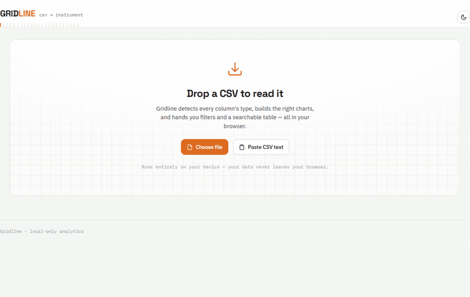

# Gridline

Gridline is a local CSV analytics dashboard. Open one HTML file, load a spreadsheet, and you get charts, pivots, statistics, forecasting, and a SQL console.

Live demo: https://archie0099.github.io/Gridline/



## Features

- **Type detection:** infers whether each column is a date, a number, or a category, and flags columns with missing values.
- **Charts:** time series, bar charts, distributions, and top categories, with an optional split by a second column and moving-average trend lines.
- **Key figures and filters:** totals, averages, and growth percentages, with live filters by category, range, and date.
- **Pivot tables:** cross-tab any dimensions with row and column totals, and export to CSV.
- **Statistics:** per-column summaries, a correlation heatmap, and a plain-language panel describing what stands out.
- **Forecasting:** projects future values with Holt or Holt-Winters, draws a confidence band, and reports a backtest accuracy score against a naive baseline.
- **Decomposition and clustering:** seasonal decomposition and k-means clustering on chosen columns.
- **SQL workspace:** run real queries in the browser with DuckDB-WASM, join several CSVs, export results, and save queries.
- **Other:** dark mode, PNG and CSV export, and Indian (lakh and crore) or international number formatting.

## Getting started

Open the live demo, or download gridline.html and open it in a browser. That single file is the whole app. Load your own CSV, or use the included sample-mandi-sales.csv. The first load fetches Chart.js and PapaParse from a CDN, and after that it works offline.

## How it works

Gridline is a single self-contained HTML file (about 3,200 lines of HTML, CSS, and JavaScript), with no framework, no build step, and no backend. It uses Chart.js and PapaParse, and loads DuckDB-WASM on demand for the SQL workspace. Data is processed locally and never leaves the browser.

## Tests

```bash
node gridline-tests.js          # 173 logic unit tests
npm install jsdom papaparse
node smoke.js                   # 27 headless-DOM integration checks
```

A full browser and DuckDB integration test is in gridline-browser-tests.js. Architecture notes are in ARCHITECTURE.md.
